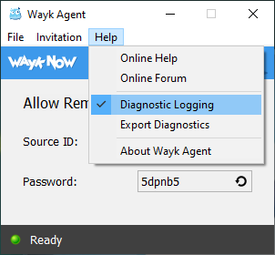

# Wayk Agent Diagnostics

## Enable Diagnostic Logging

From the Wayk Agent menu, click *Help* then check "Diagnostic Logging":

Accept the prompt to restart the application, or manually quit and relaunch Wayk Agent.

## Export Diagnostic Logs

From the Wayk Agent menu, click *Help* then *Export Diagnostics*:

Select a directory (such as "My Documents"), then click OK. You should now find a .zip file containing the Wayk Agent log files:

This .zip file can then be sent to our support team to help us diagnose issues.
