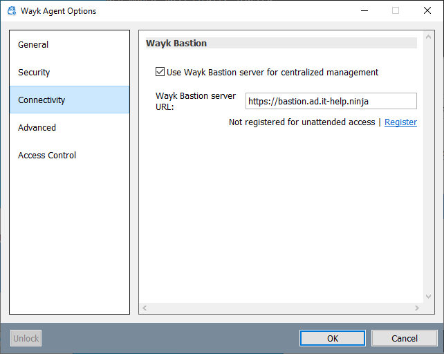

# Wayk Agent Enrollment

## Enrollment

An enrollment token can be generated in Wayk Bastion and used to register Wayk Agent for unattended access. Normally this would be done as part of an [automated deployment](../bastion/deployment-automation.md#enrollment).

### Enrollment Using UI

The enrollment status of the Agent is visible in the Options window ("Preferences" on macOS). If the Agent is not registered with the current Wayk Bastion, you will be given the option to register. If you are changing the Wayk Bastion URL, the option to register might not be available until after you have applied your changes and allowed the Agent to connect to the newly configured Wayk Bastion.

Choosing to register the machine allows you to supply the enrollment token.

### Unregistering

Once the Agent is registered with Wayk Bastion, unregistering is a two-step process:

1. Uninstall Wayk Agent from the agent machine
2. Delete the machine entry using the Wayk Bastion web interface