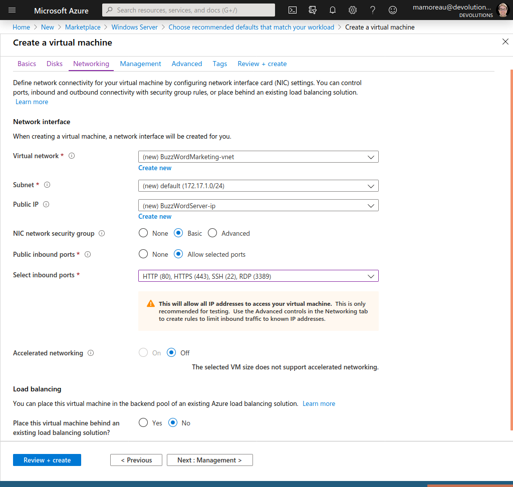
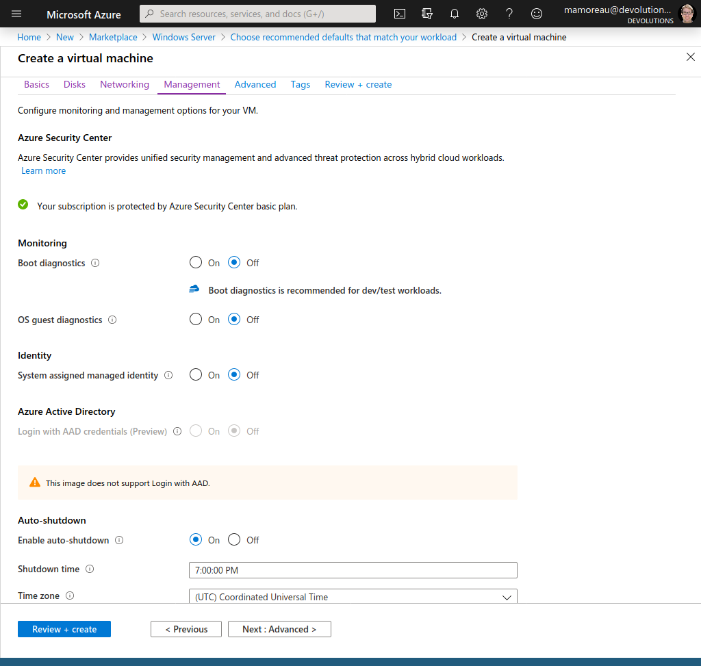
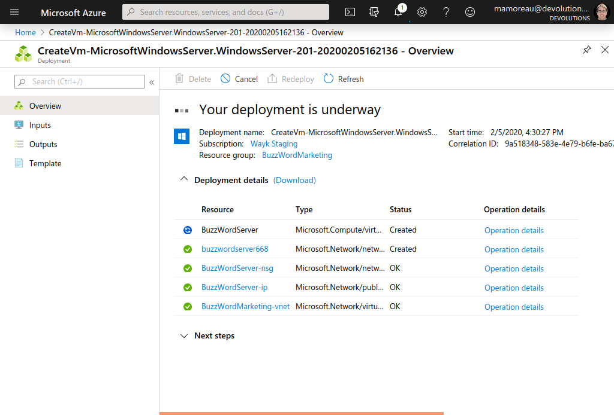
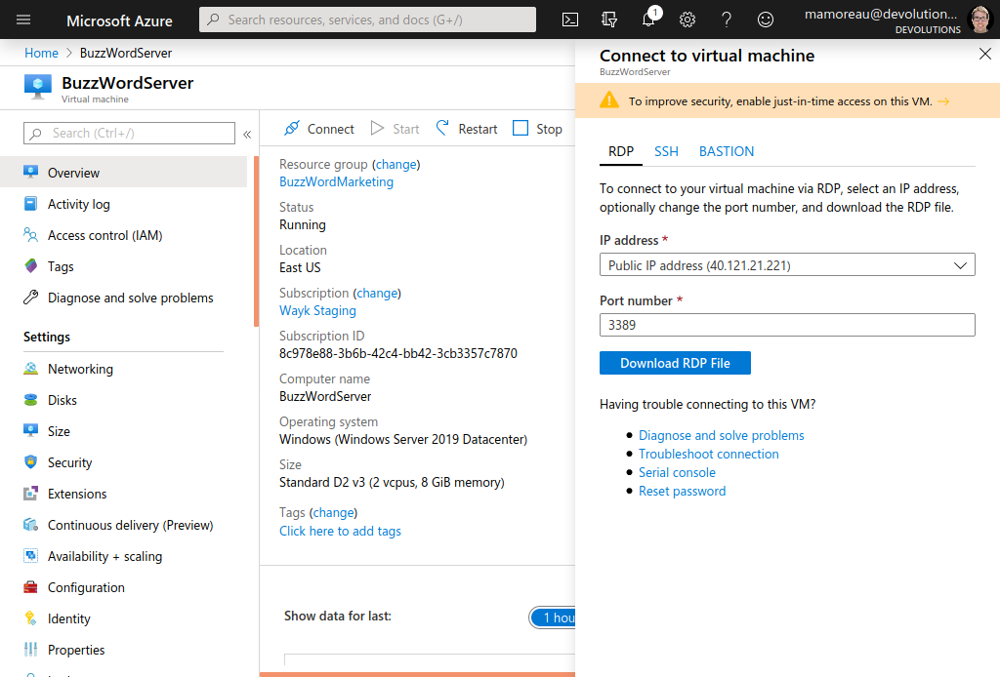
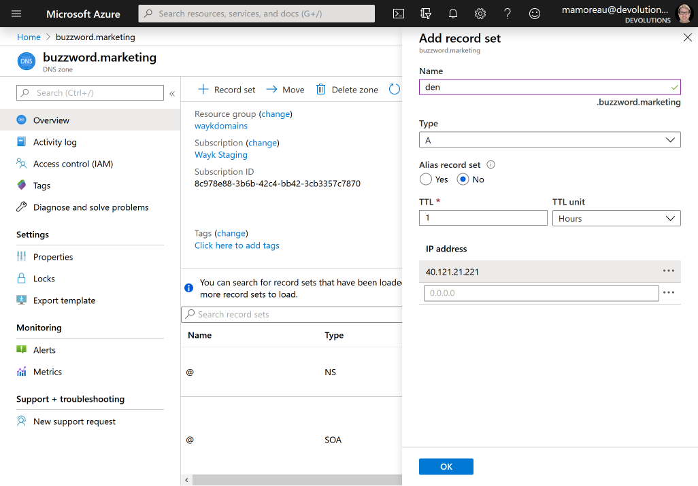

# Getting Started Guide (Azure VM)

This getting started guide provides instructions for setting up Wayk Bastion on a Windows Server 2019 Core + Containers virtual machine instance in Azure. This guide can also be followed for installation on a regular Windows Server 2019 Core virtual machine outside of Azure with minimal adjustments.

We will be deploying Wayk Bastion on an Azure VM for a fictional company called BuzzWord Marketing, with a real domain name (den.buzzword.marketing).

## Step 1: Create Azure VM

In the Azure Marketplace, find the "Windows Server" virtual machine resource, select "Windows Server 2019 Datacenter Server Core with Containers" then click "Create":

Select a workload environment based on your needs, the click "Continue to create a VM". For the purpose of this guide, I selected the recommended defaults for development and testing.

Create a resource group for the VM (BuzzWordMarketing) and name the resource BuzzWordServer. Fill the form for the Administrator account, we will be using it to access the virtual machine with RDP. Last but not least, select all inbound ports (HTTP (80), HTTPS (443), SSH (22), RDP(3389)). Click "Next: Disks" to continue.

Keep the default disk configuration, then click "Next: Networking". Keep the default networking configuration, then click "Next: Management".

To control costs on a test virtual machine, disable boot diagnostics and enable auto-shutdown. Skip the "Advanced" and "Tags" sections to go to the final "Review + Create" section.

Review the virtual machine configuration, then click "Create".

Wait for a few minutes until the virtual machine creation is completed.

Once completed, click on the virtual machine resource. Click on the "Connect" button in the menu bar on top of the screen to show connection options.

Copy the virtual machine IP address (40.121.21.221) to the clipboard and keep it for later.

Download the .rdp file and open it with an RDP client. Use the previously configured administrator account to connect to the virtual machine.

If all worked well, you should see a Windows command prompt inside an empty desktop, a good sign that you’ve successfully connected to a Windows Server core virtual machine that doesn’t have Desktop Experience installed. Type "start powershell" to open a blue PowerShell prompt instead of the default black Windows command prompt.

## Step 2: Configure DNS

Now that the virtual machine is up and running, we will create a DNS
record pointing to it. For this guide, we bought the domain
*buzzword.marketing* from [namecheap](https://www.namecheap.com),
created a corresponding [Azure DNS zone](https://docs.microsoft.com/en-us/azure/dns/dns-getstarted-portal),
then [configured namecheap with custom DNS name servers from Azure](https://www.namecheap.com/support/knowledgebase/article.aspx/767/10/how-to-change-dns-for-a-domain).

It is recommended to expose Wayk Bastion on a "den" subdomain, so we will create a DNS *A* record with "den" as the name and our public IP address (40.121.21.221) as value. Click OK, then wait for the DNS configuration to propagate, until den.buzzword.marketing can be resolved.

## Step 3: Launch Wayk Bastion

Go back to the RDP client connected to the Azure VM and the PowerShell prompt.

Make sure that the docker service is running:

    > Get-Service | Where-Object { $_.Name -Like 'docker' }
    > Start-Service -Name docker

Install the WaykDen module:

    > Install-Module -Name WaykDen -Force

Import the WaykDen module, create a new directory for Wayk Bastion files and move to it:

    > Import-Module -Name WaykDen
    > mkdir ~/den-test
    > cd ~/den-test

Create a new Wayk Bastion configuration and then import a valid TLS certificate. For testing, I have obtained a free certificate from [letsencrypt](https://letsencrypt.org/) using [Posh-ACME](https://github.com/rmbolger/Posh-ACME) and the [Azure DNS plugin](https://github.com/rmbolger/Posh-ACME/blob/master/Posh-ACME/DnsPlugins/Azure-Readme.md).

    > New-WaykDenConfig -Realm buzzword.marketing -ExternalUrl 'https://den.buzzword.marketing' -ListenerUrl 'https://localhost:443'
    > Import-WaykDenCertificate -CertificateFile .\fullchain.pfx -Password 'poshacme'

Alternatively, you can skip the TLS certificate configuration and expose Wayk Bastion in HTTP (never do this in production):

    > New-WaykDenConfig -Realm buzzword.marketing -ExternalUrl 'http://den.buzzword.marketing' -ListenerUrl 'http://localhost:80'

Finally, start Wayk Bastion:

    > Start-WaykDen -Verbose

The first launch will pull all docker images based on Windows Server Core, which can take a while because of their large size. Once started, you should be able to open <https://den.buzzword.marketing> in your browser.

From there, you can follow the [getting started guide (Argo tunnel)](getting-started-argo.md) starting from Step 4: Complete initial configuration from Wayk Bastion Web UI.
