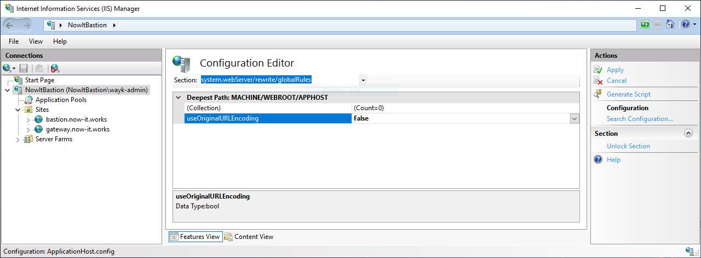
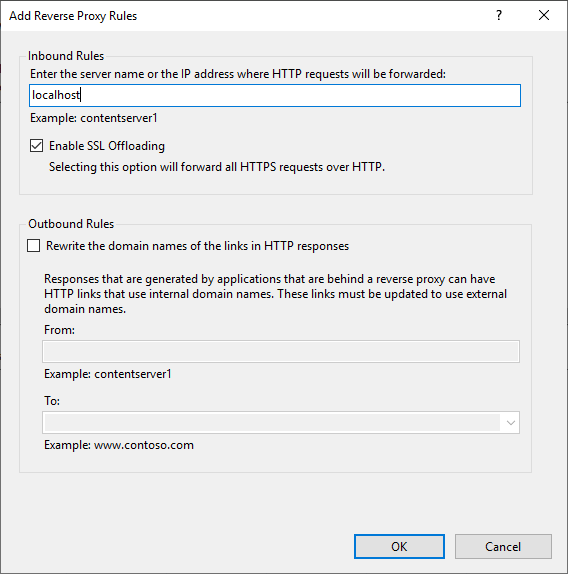

# IIS Deployment

Deploying Wayk Bastion behind IIS is possible with the URL Rewrite and Application Request Routing (ARR) modules. IIS is not necessarily the recommended deployment option for Wayk Bastion ([traefik](https://containo.us/traefik/), [nginx](https://www.nginx.com/) and [haproxy](http://www.haproxy.org/) are worthy alternatives). However, if you are comfortable with IIS or if you need it to deploy additional applications that require IIS within the same server, then it should be a good choice.

## IIS Feature Installation

Open a PowerShell prompt and install the base IIS features required (IIS server + WebSocket support + management tools)

    $Features = @(
        'Web-Server',
        'Web-WebSockets',
        'Web-Mgmt-Tools')

    foreach ($Feature in $Features) {
        Install-WindowsFeature -Name $Feature
    }

You can install additional features, but the most important not to forget is the WebSocket protocol support:


As for the IIS graphical management tools, they are recommended but not required, and they are absent from Windows Server Core.

## IIS Module Installation

The two IIS modules we need (URL Rewrite and Application Request Routing) are not available as IIS features, and need to be installed using the [Web Platform Installer](https://www.microsoft.com/web/downloads/platform.aspx).

Once you have the Web Platform Installer, install (in order) the URL Rewrite and the Application Request Routing modules:

[IIS URL Rewrite Module](https://www.iis.net/downloads/microsoft/url-rewrite)


[IIS Application Request Routing Module](https://www.iis.net/downloads/microsoft/application-request-routing)


Alternatively, you can install the modules using [chocolatey](https://chocolatey.org/install):

    choco install urlrewrite -y
    choco install iis-arr -y

However, the IIS URL Rewrite and Application Request Routing (ARR) modules are difficult to install automatically, so results may vary. The GUI installation is the most guaranteed to work.

## IIS Global Configuration

By default, IIS does not preserve the HTTP Host header when proxying requests, which breaks Wayk Bastion. The *preserveHostHeader* setting in the *system.webServer/proxy* section of the configuration needs to be set to *true*:


Alternatively, the same modification can be done at the command line:

    %windir%\system32\inetsrv\appcmd.exe set config -section:system.webServer/proxy -preserveHostHeader:true /commit:apphost

Next, set the **useOriginalURLEncoding** setting in the *system.WebServer/rewrite/globalRules* section to *false*:



The same modification can also be done at the command line:

    %windir%\system32\inetsrv\appcmd.exe set config -section:system.WebServer/rewrite/globalRules -useOriginalURLEncoding:false /commit:apphost

This change is necessary to obtain an [unmodified UNENCODED_URL variable in URL rewrite rules](https://blogs.iis.net/iisteam/url-rewrite-v2-1).

## IIS Site Configuration

In IIS manager, right-click "Sites" and select "Add Website.."


In the "Add Website" dialog, enter a site name, physical path and host name. Make sure that the host name you choose is the final one you expect to use with https and matches your certificate name.

As for the physical path on disk, it is not going to be used, but IIS requires you to have one. I have created "C:\\inetpub\\bastion", but you can use any path you want.

Click OK to create the new website, then select it from the list of sites on the left.


With the correct site selected on the left, find the "URL Rewrite" feature and double-click to open it:


Under "Actions" at the top right, click "Add Rule(s)…". In the "Add Rule(s)" dialog, select "Reverse Proxy" and then click OK.


While creating the new reverse proxy rule, you will likely be asked to enable proxy functionality (Application Request Routing). Click OK to enable it:


Upon creation of the first reverse proxy rule, you will also be prompted for the destination server. Just enter 'localhost' for now and click OK:



You should now see a single rule called "ReverseProxyInboundRule1" in the list. Double-click on it to open the "Edit Inbound Rule" view.

In the "Match URL" section, leave the "(.\*)" default pattern value. Go to the "Conditions" section and then click "Add…" to create a new condition:


In the *Action* section, select the "Rewrite" action type, and enter "http://localhost:4000/{C:1}" in the Rewrite URL field. Make sure to uncheck "Append query string" as the query string is already containing within '{C:1}' capture group (UNENCODED_URL variable).

The final result should look like this:


This URL rewrite rule will now forward incoming traffic to http://localhost:4000 with proper handling of the URL query parameter encoding. If you host Wayk Bastion on a different host and port, simply change the destination URL.

Here is the resulting web.config file containing the URL rewrite rule for reference:

```xml
<?xml version="1.0" encoding="UTF-8"?>
<configuration>
    <system.webServer>
        <rewrite>
            <rules>
                <clear />
                <rule name="ReverseProxyInboundRule1" patternSyntax="ECMAScript" stopProcessing="true">
                    <match url="(.*)" />
                    <conditions logicalGrouping="MatchAll" trackAllCaptures="false">
                        <add input="{UNENCODED_URL}" pattern="/(.*)" />
                    </conditions>
                    <action type="Rewrite" url="http://localhost:4000/{C:1}" appendQueryString="false" logRewrittenUrl="true" />
                </rule>
            </rules>
        </rewrite>
    </system.webServer>
</configuration>
```

## IIS Certificate Configuration

While obtaining a proper server certificate is outside of the scope of this guide, you still need to import it in IIS before configuring an HTTPS site binding for your site.

Valid certificates from letsencrypt can be obtained using [win-acme](https://www.win-acme.com/) and following instructions from [this blog post](https://miketabor.com/how-to-install-a-lets-encrypt-ssl-cert-on-microsoft-iis/). Alternatively, we recommend giving [Posh-ACME](https://github.com/rmbolger/Posh-ACME) a try.

To import your certificate, locate the "Server Certificates" feature and double-click on it to open it:


At the top right, under "Actions", click "Import…".


In the "Import Certificate" dialog, select your certificate in .pfx file, enter the password and then click OK.

You can now create a new HTTPS site binding. Under "Sites", right-click your site and then select "Edit Bindings…":


In the "Site Bindings" dialog, click "Add…":


Select "https" as the binding type, and enter your IIS site host name. Check "Require Server Name Indication" and "Disable HTTP/2". Click "Select…", then select the server certificate that was previously imported. Click OK to create the new site binding.

Last but not least, click on the "SSL Settings" feature of your site and make sure that "Require SSL" is unchecked, and that "Client certificates" is set to "Ignore":


Those SSL settings are sometimes confused with the HTTPS server certificate configuration. If you enable it by mistake, you may see a certificate prompt when loading the website in the browser, as it is meant to enforce client certificate authentication.

That’s it! Your IIS site is now ready. Review your Wayk Bastion configuration ListenerUrl and ExternalUrl parameters to make sure they correspond to your current configuration:

    Set-WaykBastionConfig -ListenerUrl 'http://localhost:4000' -ExternalUrl 'https://bastion.now-it.works'

Then start Wayk Bastion, and you should now be able to access it through your IIS site. If it doesn’t work the first time, try running *iisreset* once to force the configuration changes made earlier.
