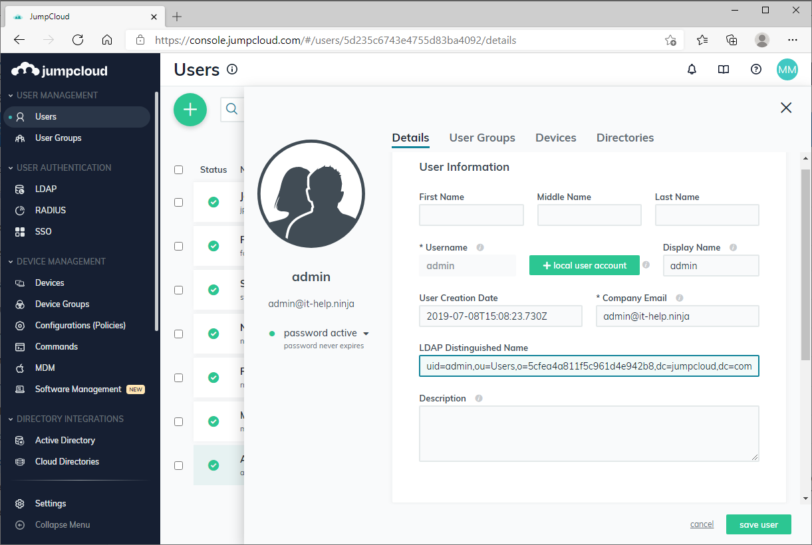
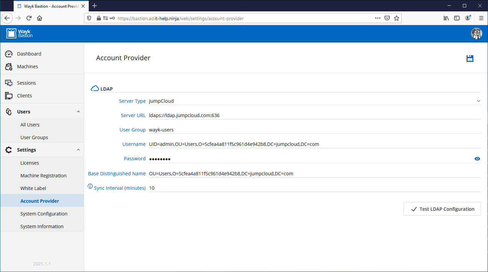

# JumpCloud Directory Integration

Wayk Bastion supports [JumpCloud](https://jumpcloud.com/) as a cloud user directory using as an alternative to Windows Active Directory. This can be particularly interesting for small organizations as JumpCloud has a free tier for up to 10 users.

To get started, you will need to create a [JumpCloud organization](https://support.jumpcloud.com/support/s/article/getting-started1), and an LDAP reader account that will be used by Wayk Bastion for synchronization.

For each of your regular users, the **LDAP Bind DN** feature must be enabled for LDAP authentication to work:

It is recommended to create a "wayk-users" group containing all the users that should be synchronized in Wayk Bastion.

The LDAP reader account is not a regular user account, it has to be configured as part of [JumpCloud's LDAP-as-a-service functionality](https://support.jumpcloud.com/support/s/article/using-jumpclouds-ldap-as-a-service1). This account is restricted to reading information from LDAP and cannot be used for regular authentication.

Once this is done, you will need to find your LDAP organization ID:

You will also need the LDAP distinguished name for the LDAP reader account:

With all this information in hand, naviguate to **Settings**, then **Account Provider** in the Wayk Bastion interface. Select **JumpCloud** as the server type, then enter the following, replacing the values with your own:

 * **Server URL**: ldaps://ldap.jumpcloud.com:636
 * **User Group**: wayk-users
 * **Username**: UID=admin,OU=Users,O=5cfea4a811f5c961d4e942b8,DC=jumpcloud,DC=com
 * **Password**: (ldap reader password)
 * **Base Distinguished Name**: OU=Users,O=5cfea4a811f5c961d4e942b8,DC=jumpcloud,DC=com

Use the **Test LDAP Configuration** button to validate the configuration, then save it using the **Save** button at the top right of the screen.

You can now go in **Users**, then **All Users**, and you should now see the list of synchronized users.

The Wayk Bastion login page should now also accept accounts with the same passwords used in JumpCloud. If authentication fails, make sure that the "LDAP Bind DN" feature is enabled in JumpCloud for all users.
