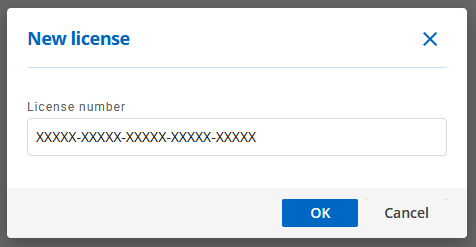

# License Management

## Adding a license

From the Wayk Bastion menu, click *Licenses*:

On the top right, click the '+' button to add a license:

Enter your license key (XXXXX-XXXXX-XXXXX-XXXXX-XXXXX), then click OK to add the license.

Your license should now be listed with its details, such as the license type and expiration.

## Assigning a license

Each Wayk Client user needs an assigned license. For instance, if you have a Wayk Client license valid for 10 users, you will need to assign the license to each of them individually. If you have one of the unlimited user licenses (site, country or global), then all users are automatically licensed and no manual license assignment is necessary.

From the Wayk Bastion menu, click *Users*, then *All Users*:

Click on the vertical ellipsis (⋮) besides a user, and then click "Manage license":

From the list, select a license to assign to the user and then click OK. This user should now be licensed for Wayk Client usage.
