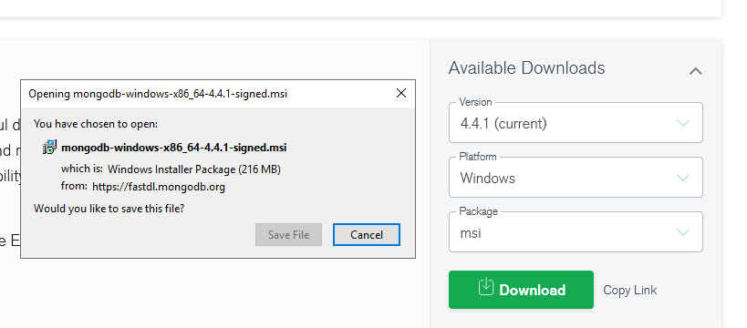
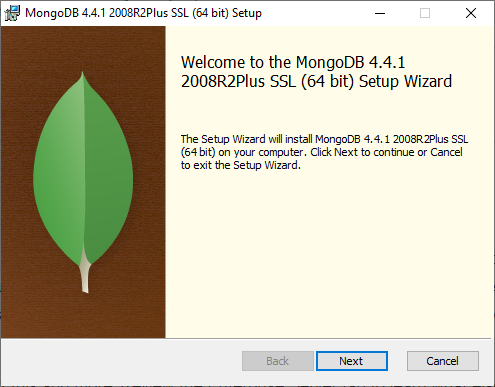
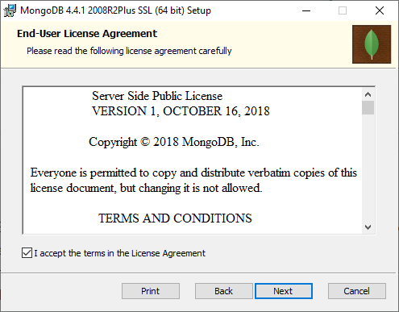
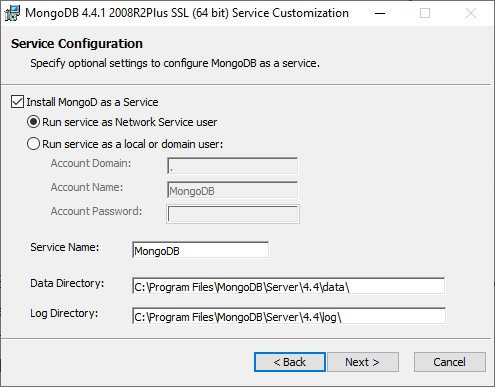
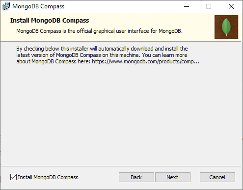
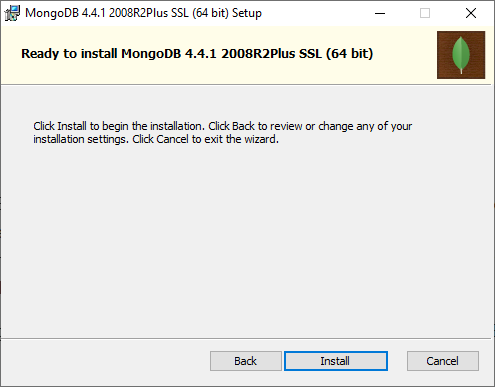
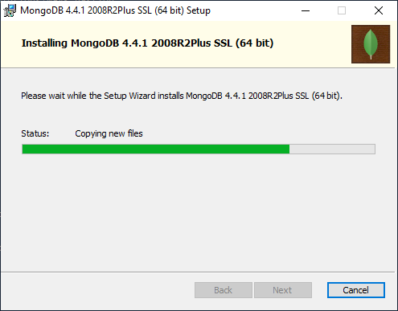
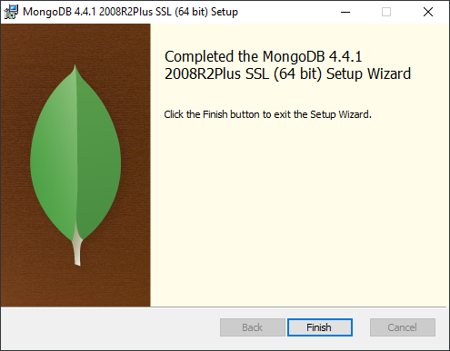
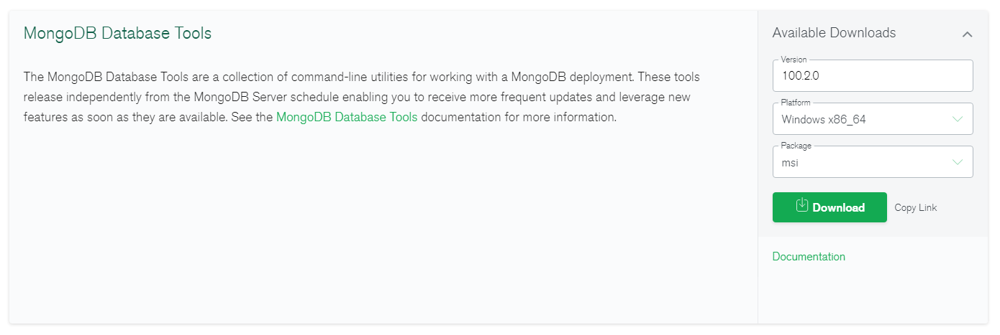

# MongoDB Installation

By default, the Wayk Bastion PowerShell module creates MongoDB container and a Docker volume to store its data. While this may be good enough for most, a regular MongoDB installation is preferable, especially if high availability is required.

## MongoDB Server

Download the [MongoDB .msi installer for Windows](https://www.mongodb.com/try/download/community).



Launch the .msi installer, then click Next.



Accept the license agreement, then click Next.



Leave the default options, then click Next.



If you wish to install MongoDB Compass, check "Install MongoDB Compass", then click Next. While it is a very convenient MongoDB GUI, it can take several minutes to install.



Click Install to begin the installation.



Wait for the installation to complete. If you selected MongoDB Compass, it will take a few minutes, so be patient.



Click Finish to complete the installation.



That's it, you should now have a "MongoDB" system service started automatically, with files stored under "C:\Program Files\MongoDB\Server\4.4\bin".

### Network Configuration

Once the MongoDB server is installed, a few configuration settings need to be tweaked to make it usable from the containers. Open the mongod.cfg configuration file located inside the 'bin' directory of the MongoDB server with a text editor, [then look for the following section](https://focusedforsuccess.com/how-do-i-make-mongodb-listen-on-all-interfaces):

```
# network interfaces
net:
  port: 27017
  bindIp: 127.0.0.1
```

Change 'bindIp: 127.0.0.1' to 'bindIpAll: true', then save the changes:

```
# network interfaces
net:
  port: 27017
  bindIpAll: true
```

Restart the MongoDB service for the changes to be applied:

```powershell
Restart-Service MongoDB
```

This change is necessary because Windows container use a special network interface to communicate with the host.

## MongoDB tools

In order to perform MongoDB management on the host, you will need to install the [MongoDB management tools](https://docs.mongodb.com/database-tools/installation/).

### chocolatey

You can install the MongoDB database tools with chocolatey:

```powershell
choco install mongodb-database-tools
```

This is the recommended installation method, as it automatically adds to the tools to the system PATH.

### .msi installer

Download the [.msi installer](https://www.mongodb.com/try/download/database-tools) or equivalent package for your platform:



Once installed, the tools should be located in directory that looks like "C:\Program Files\MongoDB\Tools\100\bin". You will need to add it to your system PATH before invoking the tools.

## Migrating to an external database

If you have been using the internal database automatically created as a Windows container, follow these steps to migrate your data and switch to the new MongoDB database server.

```powershell
Enter-WaykBastion -ChangeDirectory
Stop-WaykBastion
$BackupFile = "bastion-backup-$(Get-Date -Format 'FileDateUniversal').tgz"
Backup-WaykBastionData -BackupPath ".\${BackupFile}"
```

Make sure that the backup file was correctly created:

```powershell
PS > Get-Item $BackupFile


    Directory: C:\ProgramData\Devolutions\Wayk Bastion


Mode                LastWriteTime         Length Name
----                -------------         ------ ----
-a----        11/6/2020  12:54 PM          40254 bastion-backup-20201106Z.tgz
```

Then make sure that the 'mongorestore' command is available on the host:

```powershell
PS > [bool]$(Get-Command mongorestore)
True
```

If the command cannot be found, install the MongoDB database tools and modify your system PATH environment variable to include them.

We are now ready to try restoring the database contents into the new MongoDB database server running on the host. Make sure that the MongoDB system service is up and running:

```powershell
PS > Get-Service MongoDB

Status   Name               DisplayName
------   ----               -----------
Running  MongoDB            MongoDB Server (MongoDB)
```

Run the 'mongorestore' command using the previous backup file, and the destination MongoDB server:

```powershell
mongorestore --drop --gzip --archive=$BackupFile --uri mongodb://localhost:27017
```

While 'localhost' works on the host, it won't work inside containers: instead, you need to use the explicit host name or IP address of the MongoDB host. We will use the hostname 'MongoHost' but it needs to be replaced by the real name of your host to work within Wayk Bastion containers:

```powershell
$MongoHost = "MongoHost"
Stop-WaykBastion
Set-WaykBastionConfig -MongoExternal $True -MongoUrl "mongodb://${MongoHost}:27017"
Start-WaykBastion
```

If the 'den-mongo' container was not stopped prior to the configuration change, it may still be running. You can stop it with "docker stop den-mongo" if it is the case. If everything worked well, all containers expect 'den-mongo' should be up and running.

If some containers failed to started due to MongoDB connection errors, verify the following:

1. The MongoUrl parameter points to a reachable host where the MongoDB server is running
1. The MongoDB server configuration file (mongod.cfg) was modified with 'bindIpAll: true'
1. The firewall is not blocking connections on TCP/27017 in between containers and the host

Otherwise, congratulations: Wayk Bastion is now correctly configured to use an external MongoDB server!
