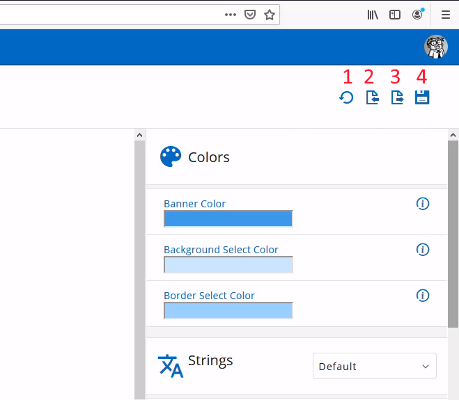
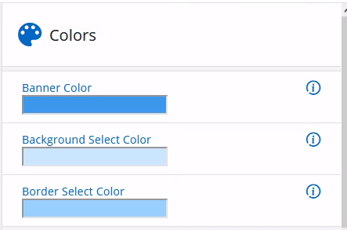
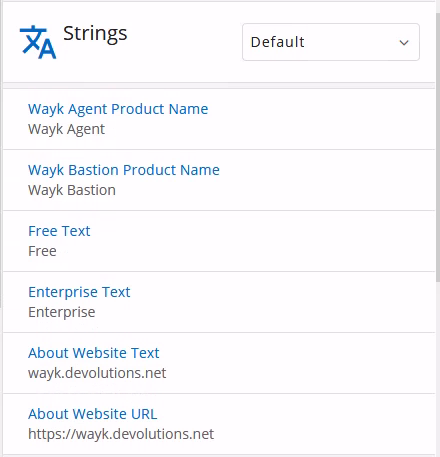
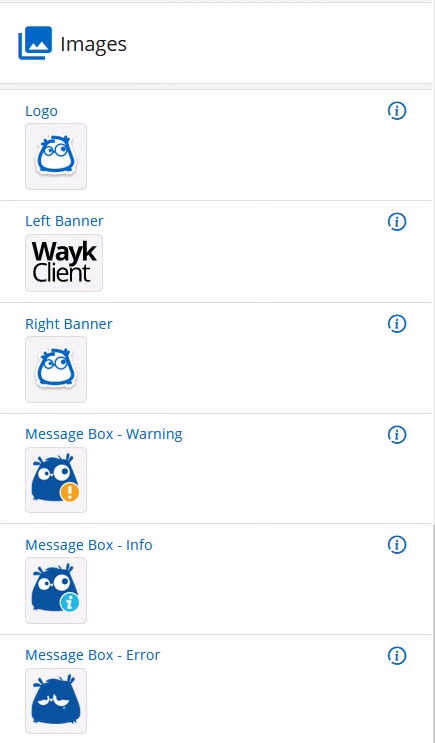

# White Label Branding

The Wayk Agent program appearance and branding can be customized using the Wayk Bastion white label editor. Using your company branding for the Wayk Agent helps making it more recognizable to customers that you need to support.

## White Label Editor

In the navigation menu, go to **Settings** then **White Label** to find the Wayk Bastion white label editor. The left pane is a live preview of the application, and the right pane lets you edit colors, strings, icons and images.

## Action Buttons

At the top right of the screen, there are four action buttons:

1. **Reset** white label resources to default state
2. **Import** white label resources branding.zip file
3. **Export** white label resources to branding.zip file
4. **Save** white label resources modifications and apply them

The easiest way to get started is to experiment with modifying everything to see what it does and then press the reset button to start fresh with the real changes. Each element has a tooltip with important information about each resource, such as size requirements.

Once the branding modifications are done, you can press the **Save** button to apply them. The resulting branding.zip will be saved and automatically distributed to Wayk Agent when it connects to Wayk Bastion. You may need to restart Wayk Agent for the changes to take effect.

It is a good idea to export the branding.zip file, such that you can reimport it later in other Wayk Bastion deployments. The branding.zip file can also be embedded in the [Wayk Agent custom executable](xref:deployment-automation), with the advantage of applying the custom branding before the first application launch.

## Colors Section

Select the colors used throughout the application:

## Strings Section

Change some of the strings in the application for multiple languages:

## Icons Section

Add your own application icons for Windows and macOS, including the high DPI formats for best results:

## Images Section

Change some of the images used throughout the application, such as the logo and the banner image:

