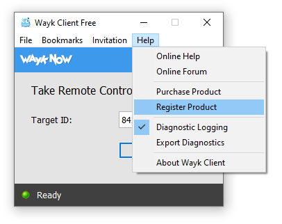

# Wayk Client Licensing

Wayk Client requires a license to make remote desktop connections to machines managed by Wayk Bastion.

## Centralized Management

Wayk Client licensing is centrally managed in Wayk Bastion, saving the trouble of sharing license keys with everyone (and losing track of them!). Instead, follow these three steps:

1. Add Wayk Client licenses in Wayk Bastion
1. Assign Wayk Client licenses to individual users
1. Login in to Wayk Bastion from Wayk Client with a licensed user

Refer to [Wayk Bastion license management](xref:wayk-license-management) to learn how to add licenses and assign them to individual users, then follow the steps for the [Wayk Client user login](xref:wayk-client-user-login).

## Client-side Management

Wayk Client licenses can be configured client-side in the following exception cases:

1. Wayk Client is used without Wayk Bastion (not recommended)
1. Wayk Client is used with the public Wayk Bastion (den.wayk.net)

To add the Wayk Client license, go to *Help* -> *Register Product*:

Enter your Wayk Client license, then click "Apply":

